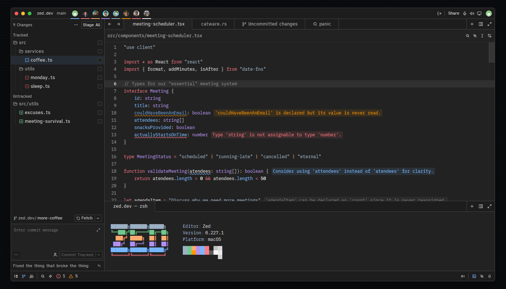

# RX Theme

A minimalist dark theme for [Zed](https://zed.dev) with deep neutral tones, designed for long coding sessions with minimal eye strain.

## Installation

1. Open Zed
2. Go to `Settings` → `Extensions`
3. Search for "RX Theme"
4. Install and select "RX Theme Dark"

## Features

- 🌙 Optimized dark theme
- 🎨 Neutral color palette
- 💻 Full syntax highlighting
- ⚡ Fast performance

## Screenshots

## Supported Languages

JavaScript, TypeScript, Python, Rust, Go, Ruby, PHP, Java, C/C++, HTML, CSS, JSON, YAML, SQL, Markdown, and more.

## License

GNU General Public License v3.0

## Author

**ruxwez**

---

For more information, visit the [repository](https://github.com/ruxwez/zed-rx-theme).
